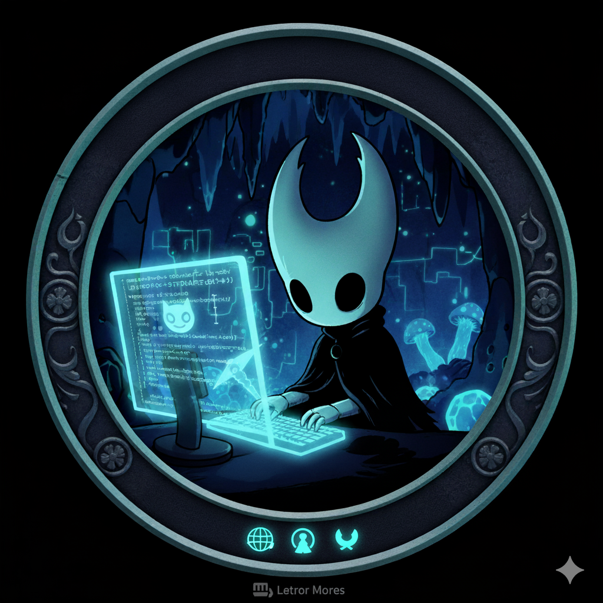

  
  <h1>
     Hi, I'm NigrumH0do!
  </h1>

### 👨‍💻 About Me

I'm passionate about technology and software development. I love experimenting with different operating systems and finding creative solutions to problems. I'm always learning something new.

- 🔭 I’m currently working on **AppScript**.
- 🌱 I’m currently learning about **React/Docker**.
- 🤔 You can ask me about Linux, scripting, or backend development.
- 📫 How to reach me: **jpinillaz@unal.edu.co**.
---
### 🚀 My Technology Stack

These are some of the technologies that I have experience with:

**Languages:**

  
  
  
  

**Operating Systems**

  
  
  

---

### 📊 GitHub Statistics

  

---
</a>

