  
  <h1>Hi, I'm NigrumH0do! 👋</h1>
  <h3> Backend Developer & Automation Specialist</h3>

---

### 👨‍💻 About Me

I specialize in **optimizing workflows** and building robust systems that bridge the gap between simple tools and enterprise needs. I don't just write code; I orchestrate solutions using **n8n workflows**, bash scripting, and Java backends.

- 🔭 **Current Focus:** Deploying autonomous agents and maintaining **24/7 headless Linux servers**.
- 💡 **Core Skills:** Java Backend, **n8n Automation**, System Integration, Edge AI (YOLO).
- ⚡ **Infrastructure:** Learning **Debian/Arch/Ubuntu** environments on embedded hardware (Raspberry Pi 5 / Radxa).
- 📫 **Contact:** jpinillaz@unal.edu.co
---

### 🛠️ Featured Engineering Experience 

#### 1. Virtual Bingo Infrastructure & Tooling
**Role:** Automation Developer | **Tech:** Java, SMTP Protocols, Image Processing.

Developed the critical surrounding infrastructure for a Virtual Bingo streaming business, integrating with a third-party game engine to enable mass-scale operations.

* **Asset Customization Engine:** Built a Java-based editor to programmatically customize background assets for thousands of bingo cards, adapting them to different corporate branding needs.
* **Mass Distribution System:** Engineered an automated mailing service capable of dispatching thousands of unique game cards via email without triggering spam filters.
* **Impact:** Transformed a manual, local game into a scalable service capable of handling massive virtual events.

#### 2. High-Concurrency Event Management System (AppScript)
**Role:** Full Stack Automation Engineer | **Tech:** Google AppScript, JavaScript, QR Technology.

Engineered a mission-critical system serving **850+ active students daily** entirely within the Google Workspace ecosystem. The system handles recurrent activity registrations and access control with 99.9% uptime.

* **Pure AppScript Optimization:** Pushed the limits of the Google ecosystem to support hundreds of concurrent users without external databases. I implemented strict validation logic and efficient memory management to avoid execution time-outs.
* **Batch Processing & QR Access:** To handle peak traffic (entry/exit), the system uses a local caching strategy that scans QR codes instantly and performs **bulk writes** to the database (Sheets) every 5 minutes. This prevents API bottlenecks.
* **Security & Auth:** Developed a custom authentication mechanism using UUIDs stored in LocalStorage (similar to JWT), managing session permissions securely without a traditional backend.

```mermaid
graph TD
    %% Nodes
    User((👤 Student/User))
    PublicTable[📄 Public Activity Table]
    Form[📝 Registration Form]
    
    subgraph "Core AppScript Ecosystem"
    Trigger(⏱️ Time Trigger)
    Script{⚙️ Google AppScript Engine}
    Mail[📧 Confirmation Email + QR]
    end
    
    subgraph "Database Layer (Sheets)"
    ListAct[(📗 Activity List)]
    ListProm[(📗 Students List)]
    DbInscrip[(📗 Registrations DB)]
    end

    subgraph "Access Control"
    QR[📱 QR Scanner App]
    end

    %% Flow
    User -->|Views Slots| PublicTable
    PublicTable -.->|Read| DbInscrip
    User -->|Submits| Form
    
    %% Registration Logic
    Form -->|OnSubmit| Script
    Script <-->|"Validate Quota"| ListAct
    Script <-->|"Auth Check"| ListProm
    Script -->|"Write Data"| DbInscrip
    Script -->|"Send Asset"| Mail
    Mail -->|"Receive QR"| User
    
    %% Attendance Logic
    User -->|"Presents QR"| QR
    QR -->|Scans| Script
    Script -->|"Batch Update (Entry/Exit)"| DbInscrip
    Trigger -->|"Syncs every 5min"| Script

    style Script fill:#2A2CBF,stroke:#333,stroke-width:2px
    style QR fill:#D91674,stroke:#333,stroke-width:2px
```

#### 3. Edge AI & Linux Infrastructure
**Role:** Embedded Engineer | **Tech:** Python, YOLO, n8n, Linux (Arch/Debian), Systemd.

Implementation of Computer Vision systems on resource-constrained hardware with automated reporting.

* **OS Hardening & Optimization:** Configured **headless Arch Linux** environments on Radxa Dragon Q6a and RPi 5, managing custom **systemd services** to ensure auto-recovery and 24/7 uptime.
* **AI & Workflow Integration:** Deployed YOLO models for real-time tracking and connected detection events to **n8n pipelines** for instant alerts/logging.
---

### My Technology Stack

**Languages & Frameworks**

  
  
  
  
  

**Infrastructure & OS**

  
  
  
  
  

---
